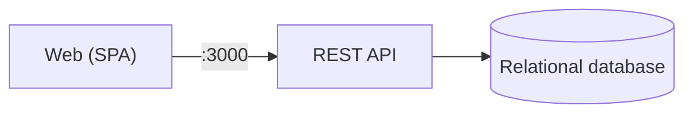
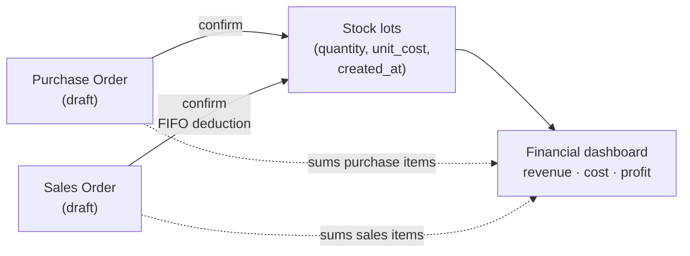
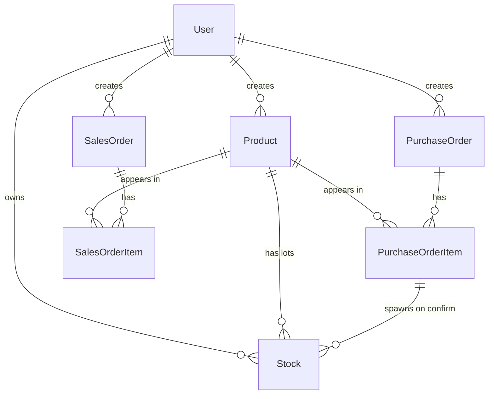

# Inventory Management

A lightweight inventory and orders system aimed at small CPG businesses (food, cosmetics, etc.). It tracks products, records purchases and sales, manages stock per lot with FIFO, and renders a dashboard with revenue, cost and profit.

Backend in Django + DRF, frontend in React + Mantine — everything runs with `docker-compose up --build`.

---

## How to run it

```bash
docker-compose up --build
```

Then open:

- App: <http://localhost:3000>
- API: <http://localhost:8000>
- Swagger: <http://localhost:8000/api/docs/>

Migrations run on their own at boot. A demo account is also seeded automatically on first boot:

- **Username:** `demo`
- **Password:** `demo1234`

It comes pre-loaded with products, purchase orders, sales orders, and financial data so you can explore the dashboard right away. You can also create your own user via the registration screen.

---

## Architecture

### Deployment

Three units talking to each other — a web client, a REST API, and a relational database, all wired by `docker-compose.yml`. The concrete stack is listed in [Stack](#stack).



### Domain flow

The system is built around three entities — **Purchase Orders**, **Sales Orders**, and **Stock** — and two state transitions: `confirm` on each order type. Everything else (the dashboard, per-product summaries, current balance) is read-only aggregation on top of these.



- **Confirming a purchase order** spawns one new stock lot per item, each carrying its own `unit_cost` and `created_at`.
- **Confirming a sales order** deducts from the oldest available lots first (FIFO), never deleting rows — `available_quantity` just goes down.
- **The dashboard** reads confirmed orders and the lot table to compute revenue, total acquisition cost, and profit per product.

---

## Database



The core idea is that **`Stock` is per lot, not per balance**: every confirmed purchase creates a new row with its own unit cost. When something is sold, the system deducts from the oldest lots first (FIFO).

---

## Trade-offs

Every interesting decision has a cost. The table below is honest about what was given up:

| Decision | What we gained | What we gave up |
|---|---|---|
| **`Stock` per lot, not an aggregated balance** | FIFO costing and per-lot traceability ("which purchase did this come from?") | Reading "current stock" needs a `SUM(available_quantity)` aggregate every time, instead of a single column |
| **Cross-user access returns 404, not 403** | An attacker probing `/api/products/{id}/` can't enumerate other users' IDs | A bit harder to tell "is this missing or just someone else's?" when debugging from logs |
| **Dashboard reports total acquisition cost, not COGS** | Much simpler model — no need to match each sold unit back to its specific purchase lot | After a big purchase, profit can look negative even if the business is healthy |
| **JWT without a server-side blacklist** | Stateless API, no session store, scales horizontally | No instant "log out everywhere" — revoking a leaked token means waiting for it to expire |
| **Sales confirmation runs without `SELECT FOR UPDATE`** | Simpler code, fast confirms; sequential load works correctly (covered by tests) | Two truly concurrent confirms of the same lot could race under READ COMMITTED — out of scope here, but a real risk in production |
| **No automated frontend tests (only manual checklist + bash e2e)** | Project ships fast, no extra test infra to maintain | UI regressions aren't caught automatically — Playwright would be the natural next step |

---

## API

Full, always-up-to-date docs live in Swagger:

**<http://localhost:8000/api/docs/>** (raw schema at `/api/schema/`)

Resources, all under `/api/` and protected by JWT Bearer (except `auth/register`, `auth/login`, `auth/refresh`):

- `auth/` — register, login, refresh, `me`
- `products/` and `stocks/` — products CRUD and stock lots
- `purchase-orders/` — drafts with nested items, plus `confirm` / `cancel` actions
- `sales-orders/` — same shape as purchases; `confirm` deducts stock by FIFO
- `finance/dashboard/` and `finance/products/{id}/` — aggregates and per-product summary

---

## Running without Docker (dev)

Useful for debugging with hot reload.

**Backend:**

```bash
cd backend
python3.12 -m venv venv
source venv/bin/activate
pip install -r requirements.txt

export USE_SQLITE=true     # so you don't need to spin up Postgres
python manage.py migrate
python manage.py runserver
```

**Frontend:**

```bash
cd frontend
npm install
npm run dev
```

`vite.config.ts` proxies `/api` to `http://localhost:8000` automatically — only in dev. In production, Nginx does the same job.

---

## Tests

```bash
cd backend
source venv/bin/activate
pytest -v
```

There are also end-to-end validation scripts under `backend/scripts/`:

```bash
./scripts/run_all.sh                  # runs all five below, prints summary
./scripts/e2e_smoke.sh                # happy-path smoke (27 asserts)
./scripts/validate_user_journey.sh    # mirrors the frontend QA checklist
./scripts/validate_edge_cases.sh      # FIFO, isolation, state transitions
./scripts/validate_db_consistency.sh  # cross-checks API vs raw Postgres
./scripts/validate_advanced_flows.sh  # auth lifecycle, pagination, decimals
```

In total: 145 asserts across 5 scripts + 27 smoke asserts.

---

## Continuous Integration

Every push and pull request targeting `main` runs a GitHub Actions workflow defined in [`.github/workflows/ci.yml`](.github/workflows/ci.yml), with two jobs in parallel:

- **Backend tests** — spins up Postgres 16 as a service, installs Python 3.12 dependencies, runs Django migrations and `pytest -v`.
- **Frontend checks** — installs Node 20 dependencies, runs `tsc --noEmit` and `npm run build`.

The `main` branch is protected: pushes go through PRs, and merging requires both jobs to be green.

---

## Layout

```
inventory-management/
├── .github/
│   └── workflows/ci.yml     GitHub Actions: backend tests + frontend checks
├── backend/                 Django + DRF API
│   ├── config/              settings, urls, wsgi
│   ├── accounts/            register, login, /me  (+ tests.py)
│   ├── products/            Product + Stock        (+ tests.py)
│   ├── purchases/           PurchaseOrder + confirm/cancel  (+ tests.py)
│   ├── sales/               SalesOrder + FIFO on confirm    (+ tests.py)
│   ├── finance/             dashboard and summaries (+ tests.py)
│   ├── scripts/             bash validation scripts
│   └── Dockerfile
├── frontend/                React 19 + Vite + Mantine SPA
│   ├── src/
│   │   ├── api/             per-resource axios clients
│   │   ├── components/      shared UI
│   │   ├── contexts/        auth context
│   │   ├── lib/             axios instance + interceptors
│   │   ├── pages/           screens
│   │   ├── types/           shared TypeScript types
│   │   └── utils/           formatters and helpers
│   ├── nginx.conf           production reverse proxy
│   └── Dockerfile           multi-stage build → nginx:alpine
├── docker-compose.yml       db + backend + frontend
└── README.md
```

---

## Stack

- **Backend:** Django 6, DRF, SimpleJWT, drf-spectacular, PostgreSQL 16, gunicorn
- **Frontend:** React 19, TypeScript, Vite, Mantine, TanStack Query, Tailwind, axios
- **Infra:** Docker, Docker Compose, Nginx
